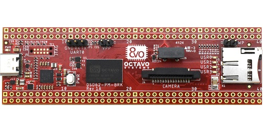

[![Static-badge-brk]][OSD62-PM-BRK webpage]
[![Static-badge-pm]][OSD62-PM webpage]

<!-- PROJECT LOGO -->
<br />
<div align="center">
  <a href="https://github.com/octavosystems/osd62-pm-brk-tisdk">
    
  </a>

  <h3 align="center">TI SDK support for OSD62-PM-BRK</h3>

  <p align="center">
    OSD62-PM Breakout Development board
    <a href="https://octavosystems.com/octavo_products/osd62-pm-brk/"><strong>Buy OSD62-PM-BRK</strong></a>
  </p>
</div>

## Requirements
Tested on Ubuntu 22.04 LTS

## Hardware accessories
| Accessory | Webpage |
| ------- | ------- |
| Microtips Technology USA (13-101HIEB0HF0-S) 10.1” WUXGA (1920x1200) TFT LCD panel| [Get from mouser.com](https://www.mouser.com/ProductDetail/Microtips-Technology/13-101HIEB0HF0-S?qs=DPoM0jnrROXJrKZYvbz3FA%3D%3D&srsltid=AfmBOorKORGzalueJGCw2ChjjN7NUauDYRYaTD_HsNdv9yGw2tSbZWaA)|
|20624: Type A 40 pin <!pitch!> FFC cable for LCD panel| !LINK NEEDED! |
|410-358: Digilent Pcan 5C with OV5640 5MP camera|[Buy from digikey.com](https://www.digikey.com/en/products/detail/digilent-inc/410-358/8111762)|
|20624: Type B 15 pin <!pitch!> FFC cable for LCD panel| !LINK NEEDED! |

## Package versions
| Package | Version | 
| ------- | ------- | 
| TI SDK version | 10.10.10.04 |
| TF-A | v2.11.0 |
| U-Boot | 2024.04 | 
| Linux Kernel | v6.6.58-ti | 

## Preparing an SD card
1. Download TI AM625-SK image from this link: https://dr-download.ti.com/software-development/software-development-kit-sdk/MD-PvdSyIiioq/10.01.10.04/tisdk-default-image-am62xx-evm-10.01.10.04.rootfs.wic.xz
2. Uncompress the file:
   ```
   uxz tisdk-default-image-am62xx-evm-10.01.10.04.rootfs.wic.xz
   ```
3. Conect SD card to Host computer
4. Determine the name of SD card:
   ```
   lsblk
   ```
5. Flash the image to the SD card (Repalce sdX with appropriate path for your SD card):
   ```
   sudo dd if=tisdk-default-image-am62xx-evm-10.01.10.04.rootfs.wic of=/dev/<sdX> bs=10M conv=fdatasync status=progress
   ```
The SD card is now prepared with a default TI AM625-SK image. You will need to modify this SD card to boot OSD62-PM-BRK using the following steps.

## Generating images for OSD62-PM-BRK:
1. Install TI Processor SDK from this link: https://dr-download.ti.com/software-development/software-development-kit-sdk/MD-PvdSyIiioq/10.01.10.04/ti-processor-sdk-linux-am62xx-evm-10.01.10.04-Linux-x86-Install.bin

2. Run TI SDK installation:
   ```
   ./ti-processor-sdk-linux-am62xx-evm-10.01.10.04-Linux-x86-Install.bin
   ```

4. Follow instructions on screen. Choose Destination location: SDK_PATH
5. Clone this repository:
   ```
   git clone https://github.com/octavosystems/osd62-pm-brk-tisdk
   ```
6. Run the setup script from osd62-pm-brk-tisdk(BRK_PATH) location
   ```
   ./osd625_brk_sdk_setup <PATH TO SDK>
   ```
7. Cahnge directory to SDK_PATH
   ```
   cd <PATH TO SDK>
   ```
8. Build u-boot
   ```
   make u-boot
   ```
9. Mount SD card's boot partition (If not automatically mounted. Note that in general, both boot and root partitions automatically mount after you insert the SD card into the Host computer)
   ```
   sudo mount /dev/<sdX>1 /media/<user_name>/boot/
   ```
10. Install u-boot binaries:
    ```
    make u-boot_install DESTDIR=/media/<user_name>/boot/
    ```
11. Build Linux device trees
    ```
    make linux-dtbs
    ```
12. Mount SD card's root partition (If not automatically mounted. Note that in general, both boot and root partitions automatically mount after you insert the SD card into the Host computer)
    ```
    sudo mount /dev/<sdX>2 /media/<user_name>/root/
    ```
13. Install OSD62-PM-BRK board device tree
    ```
    sudo cp board-support/ti-linux-kernel-6.1.83+gitAUTOINC+c1c2f1971f-ti/arch/arm64/boot/dts/ti/k3-am625-osd625-brk.dtb /media/<user_name>/root/boot/dtb/ti/
    ```
14. [#Optional] Install Display panel device tree overlay
    ```
    sudo cp board-support/ti-linux-kernel-6.1.83+gitAUTOINC+c1c2f1971f-ti/arch/arm64/boot/dts/ti/k3-am625-osd625-brk-microtips-mf101hie-panel.dtbo /media/<user_name>/root/boot/dtb/
    ```
15. [#Optional] Install CSI Camera overlay
    ```
    sudo cp board-support/ti-linux-kernel-6.1.83+gitAUTOINC+c1c2f1971f-ti/arch/arm64/boot/dts/ti/k3-am625-osd625-brk-csi2-ov5640.dtbo /media/<user_name>/root/boot/dtb/
    ```
16. [#optional] Enable Display+Camera overlay. If you only have a display or camera connected, you can remove the other overlay from the command below:
    ```
    echo "name_overlays=k3-am625-osd625-brk-microtips-mf101hie-panel.dtbo k3-am625-osd625-brk-csi2-ov5640.dtbo" >> /media/<user_name>/boot/uEnv.txt
    ```
17. Unmount the SD card
    ```
    sudo umount /media/<user_name>/*
    ```
The SD card is not ready. You can insert the SD card into OSD62-PM-BRK's SD card slot.

## Powering your OSD62-PM-BRK board


<!-- MARKDOWN LINKS & IMAGES -->
[OSD62-PM-BRK webpage]: https://octavosystems.com/octavo_products/osd62-pm-brk/
[OSD62-PM webpage]: https://octavosystems.com/octavo_products/osd62x-pm/
[Static-badge-brk]: https://img.shields.io/badge/OSD62--PM--BRK-FF0000
[Static-badge-pm]: https://img.shields.io/badge/OSD62--PM-FF0000
